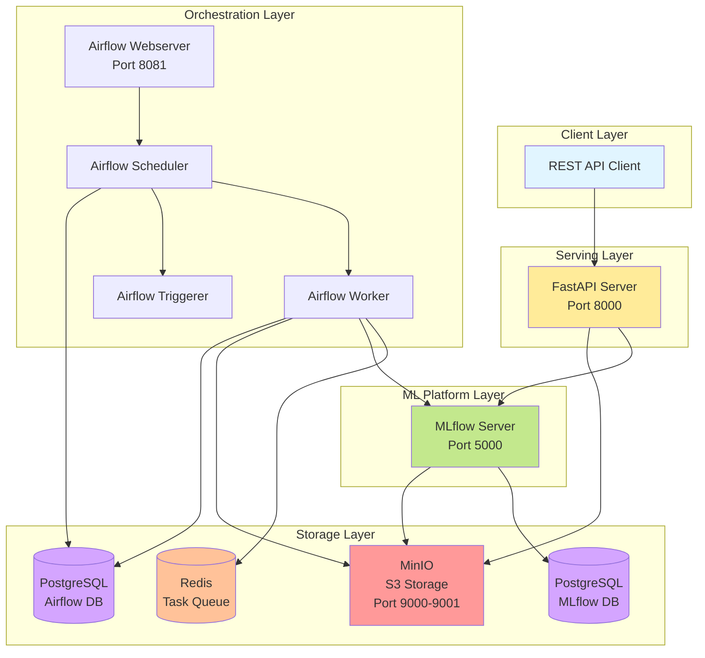
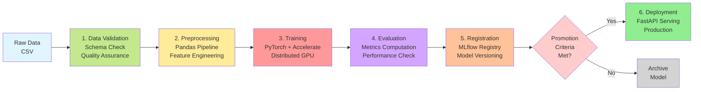
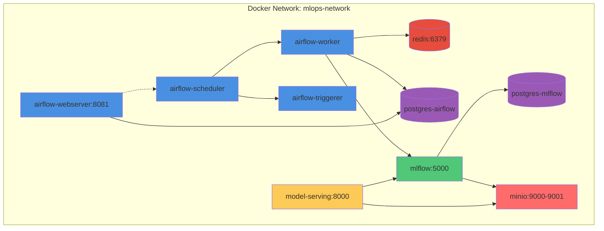
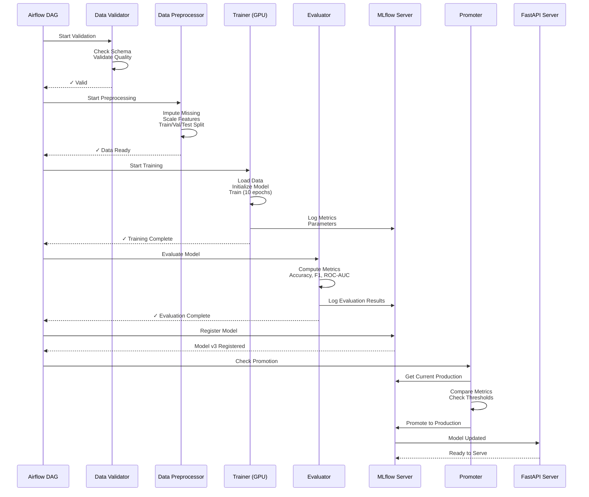
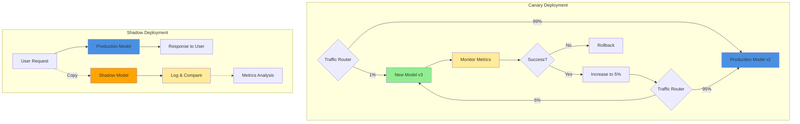

# Mermaid Architecture Diagrams for MLOps Pipeline Presentation

## 1. System Architecture Overview



**Usage:** Convert to PNG using [Mermaid Live Editor](https://mermaid.live/) or `mmdc` CLI tool.  
**Filename:** `architecture_overview.png`

---

## 2. Data Flow Pipeline



**Usage:** Convert to PNG for pipeline flow visualization.  
**Filename:** `pipeline_flow.png`

---

## 3. Docker Services Network



**Usage:** Convert to PNG for Docker services visualization.  
**Filename:** `docker_services.png`

---

## 4. Training Workflow (Detailed)



**Usage:** Convert to PNG for training workflow sequence.  
**Filename:** `training_workflow.png`

---

## 5. Model Deployment Strategies



**Usage:** Convert to PNG for deployment strategies visualization.  
**Filename:** `deployment_strategies.png`

---

## How to Generate PNG Images

### Option 1: Mermaid Live Editor (Easiest)
1. Visit [https://mermaid.live/](https://mermaid.live/)
2. Paste each Mermaid code block
3. Click "Actions" → "PNG" to download

### Option 2: Mermaid CLI (Command Line)
```bash
npm install -g @mermaid-js/mermaid-cli

mmdc -i mermaid_charts.md -o architecture_overview.png -s 1
mmdc -i mermaid_charts.md -o pipeline_flow.png -s 2
mmdc -i mermaid_charts.md -o docker_services.png -s 3
mmdc -i mermaid_charts.md -o training_workflow.png -s 4
mmdc -i mermaid_charts.md -o deployment_strategies.png -s 5
```

### Option 3: VS Code Extension
1. Install "Markdown Preview Mermaid Support" extension
2. Open this file in VS Code
3. Right-click on diagram → "Export as PNG"

---

## Inserting into LaTeX Presentation

Once you have the PNG files, update the LaTeX placeholders:

```latex
\begin{center}
\includegraphics[width=0.8\textwidth]{architecture_overview.png}
\end{center}
```

Replace `\textit{[Architecture Diagram Placeholder]}` with the `\includegraphics` command.
